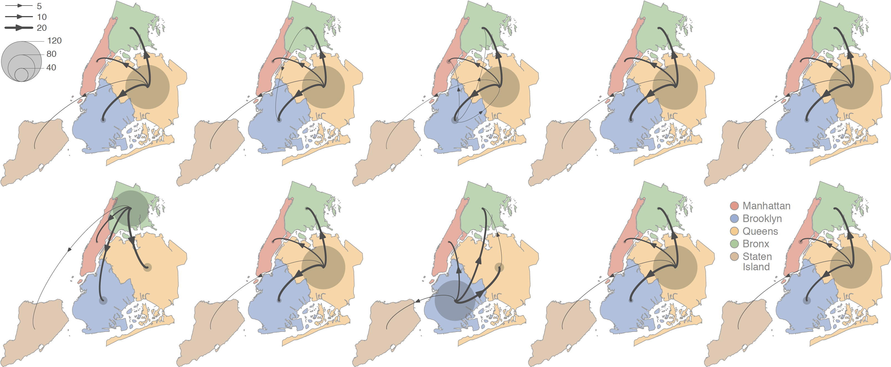

This repo gathers the input files and scripts related to our study entitled "**Dispersal dynamics of SARS-CoV-2 lineages during the first epidemic wave in New York City**" ([Dellicour *et al*. 2021](https://journals.plos.org/plospathogens/article?id=10.1371/journal.ppat.1009571), *PLoS Pathogens*). R scripts related to the analyses are all gathered within the file `Phylogenetic_analyses.r`.

Abstract: During the first phase of the COVID-19 epidemic, New York City rapidly became the epicenter of the pandemic in the United States. While molecular phylogenetic analyses have previously highlighted multiple introductions and a period of cryptic community transmission within New York City, little is known about the circulation of SARS-CoV-2 within and among its boroughs. We here perform phylogeographic investigations to gain insights into the circulation of viral lineages during the first months of the New York City outbreak. Our analyses describe the dispersal dynamics of viral lineages at the state and city levels, illustrating that peripheral samples likely correspond to distinct dispersal events originating from the main metropolitan city areas. In line with the high prevalence recorded in this area, our results highlight the relatively important role of the borough of Queens as a transmission hub associated with higher local circulation and dispersal of viral lineages toward the surrounding boroughs.

**Figure: schematic overview of the discrete phylogeographic analyses of the main SARS-CoV-2 clade circulating in New York City (NYC) during the first epidemic wave.** These maps schematize the outcome of each replicated discrete phylogeographic inference based on a random subset of genomic sequences (see the Methods section for further detail). We here report the number of lineage dispersal events inferred among (arrows) and within (transparent grey circles) NYC boroughs, both measures being averaged over 1,000 posterior trees sampled from each posterior distribution. See also Figure S4 for the estimated Markov jumps among NYC boroughs, an alternative yet congruent representation of the lineage transition events inferred by discrete phylogeographic analyses.